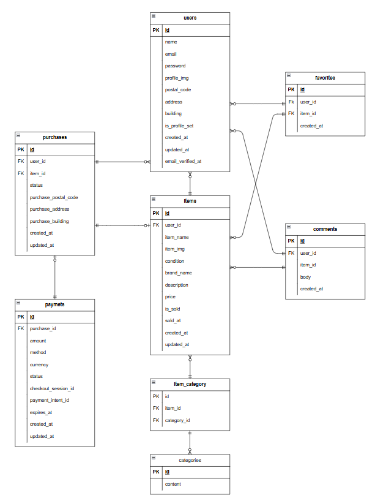

# COACHTECH フリマアプリ

模擬案件で作成したフリマアプリです。
ユーザー登録、ログイン、商品の出品・購入、検索、お気に入り商品のマイリストへの登録（いいね機能）、コメント機能、Stripe によるカード支払い、コンビニ払いに対応した決済を実装しています。

## 環境構築

**Docker ビルド**

1. `git clone git@github.com:hosokawauso/flea-market-app.git`
   `cd flea-market-app`
2. DockerDesktop アプリを立ち上げる
3. `docker-compose up -d --build`

**Laravel 環境構築**

1. `docker-compose exec php bash`
2. `composer install`
3. 「.env.example」ファイルを 「.env」ファイルに命名を変更。または、新しく.env ファイルを作成
4. .env に以下の環境変数を追加

```text
DB_CONNECTION=mysql
DB_HOST=mysql
DB_PORT=3306
DB_DATABASE=laravel_db
DB_USERNAME=laravel_user
DB_PASSWORD=laravel_pass

STRIPE_KEY=pk_test_xxx 
STRIPE_SECRET=sk_test_xxx 
STRIPE_WEBHOOK_SECRET=whsec_xxx 

```

5. アプリケーションキーの作成

```bash
php artisan key:generate
```

6. マイグレーションの実行

```bash
php artisan migrate
```

7. シーディングの実行

```bash
php artisan db:seed
```

8. ストレージのシンボリックリンク

```bash
php artisan storage:link
```

## テストケース

1. Feature/Unit テスト

```bash
docker compose exec app php artisan test
```

2. Dusk テスト

```bash
php artisan dusk:install
php artisan dusk
```

## 使用技術(実行環境)

・PHP 7.4.9
・Laravel 8.83.8
・MySQL 8.0.26
・Fortify 1.19.1
・Blade
・Docker/Doker Compose
・Git/GitHub
・Stripe アカウント(テストキー)
・MailHog(開発時のメール確認)

## ER 図



## URL

- 開発環境: http://localhost/
- phpMyAdmin: http://localhost:8080/
- MaliHog: http://localhost:8025/
